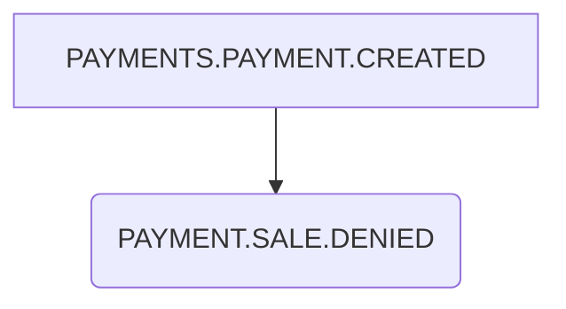
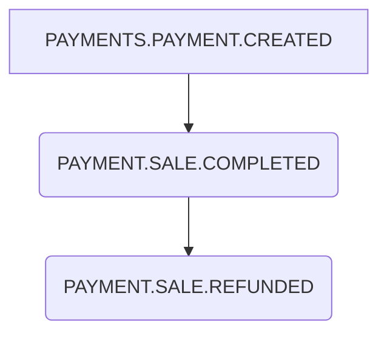
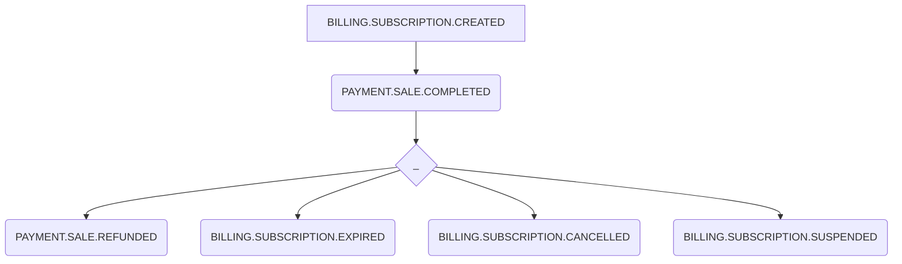
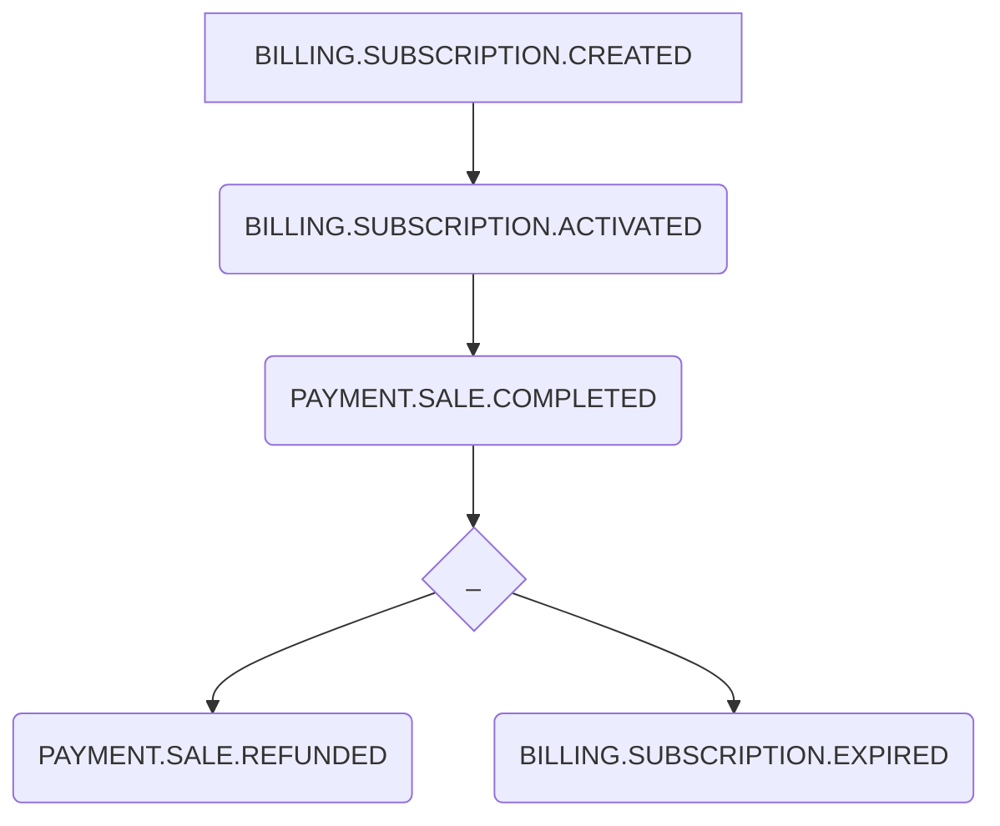
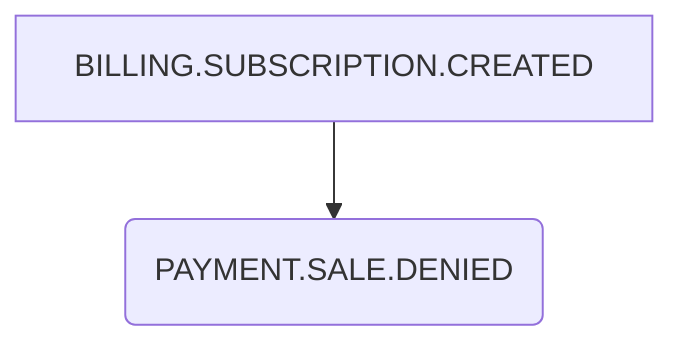
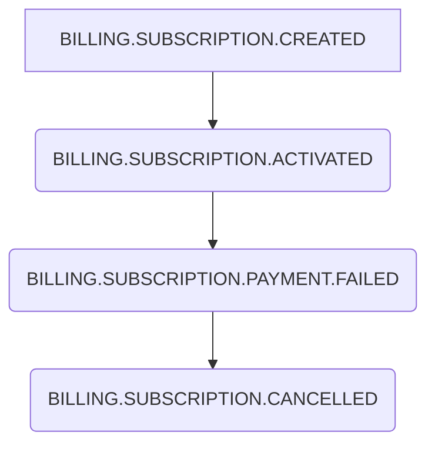

## عن عرب ستوك

موقع متخصص ببيع ملحقات التصميم من صور وفيديوهات

------------------------

## مخزن الصور

- يمكن تغيير العنوان باللغتين (عاهد)
- يمكن اسناد أوسمة للصور باللغتين (عاهد)
- يمكن اسناد تصنيفات للصور (عاهد)
- ممنوع تكرار الأوسمة (عاهد)
- بني باستخدام فيو في مجلد js_apps نأمل أن لوحة التحكم مستقبلا تدعم الفيو لتوحيد الكود
- يدعم تعدد الصفحات
- yarn install
- yarn serve
- http://localhost:8081/image_store
- يرجى نسخ (أو إنشاء اختصار) لملفات الأدمن على هذا المسار js_apps/public/admin_assets
- السيرفر سيقوم ببناء المشروع وتوليد ملفات جديدة حسب ملف devops/git_hooks/post-merge
- وأنوه إلى أنه سيتم تحديث مسارات الملفات لأنه تتولد باسماء عشوائية حتى نتجاوز التخزين المؤقت للمتصفح في الملف resources/views/admin_v2/image/warehouse/index.blade.php وسيصبح المسار /js_apps_assets/js/chunk-vendors.js إلى /js_apps_assets/js/chunk-vendors.123QwqeQWE.js

------------------------

## البحث

محرك البحث لابد أن يغطي احتياجات المستخدمين وأن يكوان واضح السلوك و
يمكن أن يستجيب للتطوير المستمر بما يخدم احتياجات العمل لذلك رأينا أن تكون 
مواصفات محرك البحث باحتياجات المستخدمين وهذه النقاط أدناه كمثال

- البحث عن كلمة "شجرة" يجب أن يعرض نتائج فيها شجرة
- البحث عن كلمة "شجرة" يجب أن يعرض اقتراحات مثل شجرة الكرسماس
- البحث عن كلمة "شجرة" يجب أن يعرض أفضل البائعين في البداية
- البحث عن كلمة "شجرة" يجب أن يعرض أن يعرض تقييم المحررين في البداية
- البحث عن كلمة "عيدالميلاد" يجب أن يعرض نتائج ل عيد الميلاد حتى لو كانت كلمة البحث متصلة
- البحث عن كلمة "مودة" يجب أن يعرض نتائج قريبة من كلمة حب لكنه لا يعرض نتائج (نعتقد إنه يجب إضافة كلمات مفتاحية لكل صورة فيها حب حتى تظهر بدون تدخل تقني)
- البحث عن كلمة "شجزة" يجب أن يعرض نتائج لشجرة حتى لو كان في حرف خاطئ

وأيضا هذا الجدول أدناه يمثل علاقة محرك البحث  مع بيانات الصورة
ويجب التنويه أن (الوصف ,متعلقات, الإكمال التلقائي, المقترحات) هي
هي البيانات المخزنة والمفهرسة  داخل محرك البحث 
بينما عمود الصفة يمثل بيانات الصورة التي تدخلها الإدارة

| الصفة            |  البحث    |  الإكمال التلقائي  |  المقترحات|
| :-------         |  :---:    | :---:             |  :---:    |
| العنوان          |   x       |                   |   x       |
| صاحب الصورة      |   x       |                   |           |
| الوصف            |   x       |                   |           |
| الوسوم           |   x       |   x               |           |
| الكلمات المفتاحية|   x       |   x               |           |
| التصنيفات        |           |                   |           |
| متميز            |           |                   |           |
| تصريح الأشخاص     |           |                   |           |
| الحالة           |           |                   |           |

(غير جاهزة) ويمكن تحسين نتائج البحث وعرض الصور المحتمل بيعها أولا (مثل الصور الأكثر مبيعا
تظهر في البداية) وذلك من خلال القيم التالية :
 - عدد المشاهدات
 - عدد المبيعات
 - تقييم صاحب الصورة
 - الجودة
 - تقييم إدارة الموقع

## تحليل النصوص

طبيب سعودي عمره ٢٠ سنة يمسك أحدث السماعات الطبية في يده

1- تقسيم حسب الكلمة
طبيب | سعودي |  عمره  | ٢٠  | سنة  | يمسك  | أحدث | السماعات | الطبية | في  | يده

2- توحيد الأرقام
طبيب | سعودي |  عمره  | 20  | سنة  | يمسك  | أحدث | السماعات | الطبية | في  | يده

3- توحيد التاء المربوطة والهاء
طبيب | سعودي |  عمره  | 20  | سنه  | يمسك  | أحدث | السماعات | الطبيه | في  | يده

4- حذف أل التعريف
طبيب | سعودي |  عمره  | 20  | سنه  | يمسك  | أحدث | سماعات | طبيه | في  | يده

5- حذف أحرف الجر وما شابه
طبيب | سعودي |  عمره  | 20  | سنه  | يمسك  | أحدث | سماعات | طبيه | يده

6- المرادفات
أيباد, آيباد, ايباد => ايباد
متعب, مرهق, نعسان => متعب
يمسك => مسك

------------------------

## تصفح الموقع حسب اللغة ( الرابط )

- يتم ترجمة  الموقع  حسب اللغة 
- يتم حفظ كود اللغة في الكوكيز

##نظام السكرول لتحميل الصور بصفحة التصنيفات

- تم عمل اول تجربة بها وبانتظار تقرير الفرونت اند 
- تم اخراج نسخة ثابتة لنظام السكرول وتحميل الصور في صفحة التصنيف

------------------------

## معالجة الصور المرفوعة

- دايما عرض الصور المصغرة 480 مهما كان الطول

## معالجة ملفات الفيديو المرفوعة

- النسخة المعروضة للبيع (SD 480, HD 720, FHD 1080, 4k 2160) وننوه أن الارتفاع هو الاساس في التوليد .. وقيمة العرض ستكون متغيرة حسب نسبة أبعاد الفيديو الأصلي
- لن يتم توليد نسخة 4k إن كان الفيديو الأصلي 4k وسيتم نسخه مباشرة
- معامل الجودةوالضغط 15 حتى لا يتم ضغط  حجم الفيديو على حساب الجودة وأيضا وحيث أن القيمة المناسبة عالميا 18-23
- توليد نسخة 426 في 240 للعرض بدون علامة مائية (وسيتم قص الفيديو ليتلاءم إن لزم)
- توليد نسخة SD للعرض ب علامة مائية
- توليد صورة png بعرض 720
- توليد صورة gif بعرض 300
- اسماء الصور عشوائية مع أن تكون المقدمة تبدأ بجودة الفيديو sd_QWER1231 
- تخزن في المسار uploads/videos/:id ثم تعالج ثم ترفع إلى s3 ثم تحذف

##تعديل نظام عرض صفحة التصنيفات واضافة مميزات جديدة

- اضافة تصنيف الاشخاص الي لوحة التحكم بحيث يتم اختيار نوع التصنيف اشخاص من كلا
اللوحتين لوحة الفيديو ولوحة الصور
- تم اضافة ملفات migration لاضافة الحقل الجديدة الي التصنيفات
- تم تعديل الfunctions  الخاصة باضافة وتعديل التصنيف بحيث تقبل تصنيف الاشخاص
- تم عمل تعديل على ملف الweb.php  بحيث يكون استدعاء صفحة التصنيفات من خلال function  داخل الcontroller  وليس مباشرة من خلال ملف الweb
- تم فرز البيانات بصفحة التصنيفات الفيديو وصفحة تصنيفات الصور
- ملاحظة مهمة في حالة لايوجد تصنيفات مدن او تصنيفات اشخاص لن يظهر الsection  الخاص بهم 

## صفحة تفاصيل الفيديو

- عرض فترة الفيديو
- عرض نسبة أبعاد الفيديو (مثل 16:9) 
- "غير جاهزة" عرض عدد الإطارات في الثانية 

## مدير ملفات رفع الصور

- فحص الملفات الموجودة بفس الاسم 
- إمكانية رفع الجديد فقط

------------------------

## نظام دخول الادمن وحل مشكلة التحويل 
- في حالة تسجيل الدخول لادمن الفيديو او الادمن الخاص بالصور راح يتحول مباشرة للوحة التحكم الخاصة به 
- تسجيل دخول الادمن جاهزة من زمان وكذلك بتحول لصفحة الادمن 
- عدلت شوية بالسايد بار الخاص بالموقع وحطيت شروط عشان اخفي تصفح البروفايل للادمن وضفتله زر وحيد اسمه لوحة المشرف 
- طبعا الزر مش متوافق مع السايد بار خالد حينسقه هلقيت
تم تغير مايلزم في كونترولير تسجيل الدخول -

## حل مشكلة اضافة للكوليكشن بالفيديو
-  app/Models/UserVideoCollection.php تم اضافة موديل جديد اسمه 
## برمجة شرط حتى لايستطيع الادمن دخول البروفايل
تم وضع شرط في الكونترولير الخاص باليوزر ويتم تحويل الادمن لرئيسية -

-----------------------

## الكلمات الأكثر بحثا

- رصد كلمات البحث حسب اللغة
- رصد كلمات البحث حسب القسم فيديو أو صورة
- عرضها أسفل مربع البحث

----------------------

## Paypal Events (Webhook)

- [Paypal Events Documentation](https://developer.paypal.com/docs/api-basics/notifications/webhooks/event-names/).

- One-Off Payment

- ImageSubscription

- manual

    - BILLING.SUBSCRIPTION.UPDATED
    - BILLING.SUBSCRIPTION.ACTIVATED
    - BILLING.PLAN.DEACTIVATED
    - BILLING.SUBSCRIPTION.CANCELLED
    - BILLING.SUBSCRIPTION.SUSPENDED

- others
    - PAYMENT.SALE.REVERSED
    - CATALOG.PRODUCT.CREATED
    - CATALOG.PRODUCT.UPDATED
    - BILLING.PLAN.CREATED
    - BILLING.PLAN.UPDATED
    - BILLING.PLAN.PRICING-CHANGE.ACTIVATED
    - BILLING.PLAN.DEACTIVATED
